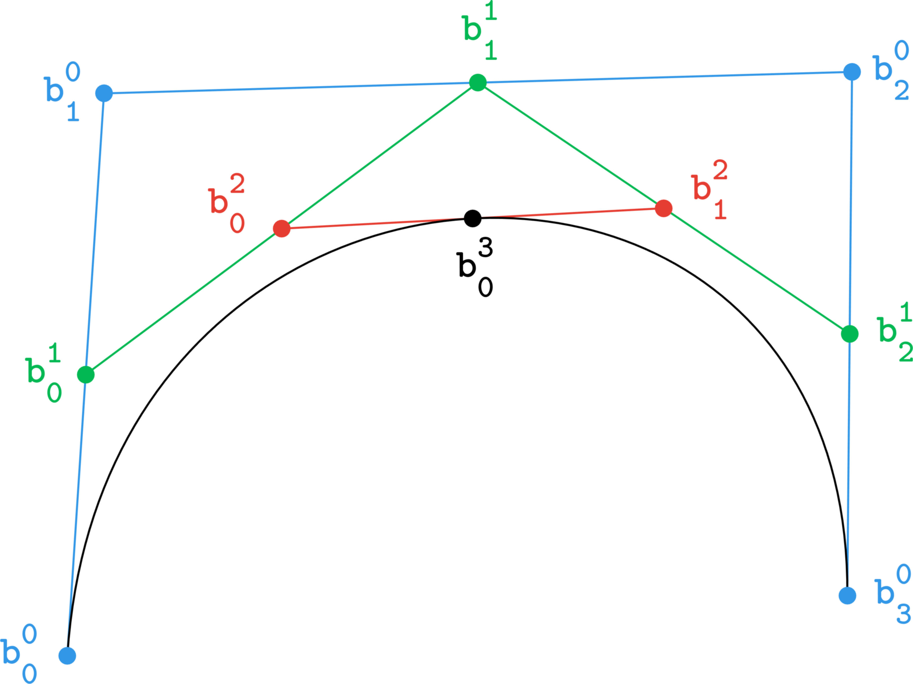

<section class="course-tp">
 

back to <a href="/teaching/geo-num-2016/">Géométrie numérique, 2016</a>

<h1>TP1 : Bézier curves, De Casteljau’s algorithm</h1>

{{ page.date | date: "%B %-d, %Y"  }}

<h2 class="first">Bézier curves</h2> 
 
A degree $n$ <a href="https://en.wikipedia.org/wiki/B%C3%A9zier_curve">Bézier curve</a> takes the form
$$ \mathbf x(t) = \sum_{i=0}^{n} \mathbf b_i B_i^n(t) \qquad t \in [0,1] $$
where
$$ B_{i}^{n}(t) = \begin{pmatrix}n \\ i\end{pmatrix} (1-t)^{n-i} t^i $$
are the degree $n$ <a href="https://en.wikipedia.org/wiki/Bernstein_polynomial">Bernstein polynomials</a>, and the binomial coefficients are defined as
$$ \begin{pmatrix}n \\ i\end{pmatrix} = \frac{n!}{(n-i)! i!}.$$
The Bézier points $\mathbf b_i \in \mathbb R^d$ form the <em>control polygon</em>.

<h2>De Casteljau’s algorithm</h2>
<ul class="algorithm">
    <li>
        input&nbsp;&nbsp;&nbsp;:  Bézier points $\mathbf b_i$ for $i = 0, \dots, n$, and parameter $t \in [0,1]$.
    </li>
    <li>
        output&nbsp;&nbsp;:  The point $\mathbf b_0^n$ on the curve.
    </li>
    <li>
        compute&nbsp;:  Set $\mathbf b_i^0 = \mathbf b_i$ and compute the points
    $$ \mathbf b_i^r (t) = (1-t) \mathbf b_i^{r-1} + t \mathbf b_{i-1}^{r-1} \qquad 
       \text{for} \qquad r=1,\dots,n, \quad i=0,\dots,n-r. $$
    </li>
</ul>

The <a href="https://en.wikipedia.org/wiki/De_Casteljau%27s_algorithm">De Casteljau’s algorithm</a> provides an efficient means for evaluating a Bézier curve $\mathbf{x}(t)$.
<figure>
    
    
Visualisation of the steps of De Casteljau's algorithm, $t=0.5$

</figure>

It is useful to look at this algorithm in its schematic form. For instance, a quintic curve ($n=5$) :

<figure style="width:100%;">
    
    

\begin{array}{cccccc}
\mathbf b_0 = \mathbf b_0^0 &               &               &               &               & \\
\mathbf b_1 = \mathbf b_1^0 & \mathbf b_0^1 &               &               &               & \\
\mathbf b_2 = \mathbf b_2^0 & \mathbf b_1^1 & \mathbf b_0^2 &               &               & \\
\mathbf b_3 = \mathbf b_3^0 & \mathbf b_2^1 & \mathbf b_1^2 & \mathbf b_0^3 &               & \\
\mathbf b_4 = \mathbf b_4^0 & \mathbf b_3^1 & \mathbf b_2^2 & \mathbf b_1^3 & \mathbf b_0^4 & \\
\mathbf b_5 = \mathbf b_5^0 & \mathbf b_4^1 & \mathbf b_3^2 & \mathbf b_2^3 & \mathbf b_1^4 & \mathbf b_0^5 \\
\end{array}
    

    
Animation of a quintic Bézier curve from <a href="https://en.wikipedia.org/wiki/User:Sam_Derbyshire/Gallery">wikpedia</a> by Sam Derbyshire

</figure>

<h2>assignements</h2>
<ol class="assignements">
<li></li>
<li></li>
<li></li>
</ol>

<h2>resources & interesting stuff</h2>
<ul class="reading">
<li>(book) <a href="http://www.farinhansford.com/books/cagd/">Curves and Surfaces for CAGD</a> by Gerald Farin</li>
<li>(book) <a href="http://www.sciencedirect.com/science/book/9780444511041">Handbook of CAGD</a>, edited by Gerald Farin, Josef Hoschek, Myung-Soo Kim</li>
<li><a href="http://pomax.github.io/bezierinfo/">A Primer on Bézier Curves</a> by Pomax</li>
<li><a href="http://jeremykun.com/2013/05/11/bezier-curves-and-picasso/">Bézier curves and Picasso</a> by Jeremy Kun</li>
<li><a href="http://learn.scannerlicker.net/2014/04/16/bezier-curves-and-type-design-a-tutorial/">Bézier Curves and Type Design: A Tutorial</a> by Fábio Duarte Martins</li>
<li><a href="http://bezier.method.ac/">The Bézier Game</li>
<li><a href="http://tholman.com/bezier-curve-simulation/">Bézier Curve Simulation</li>
</ul>

</section>
